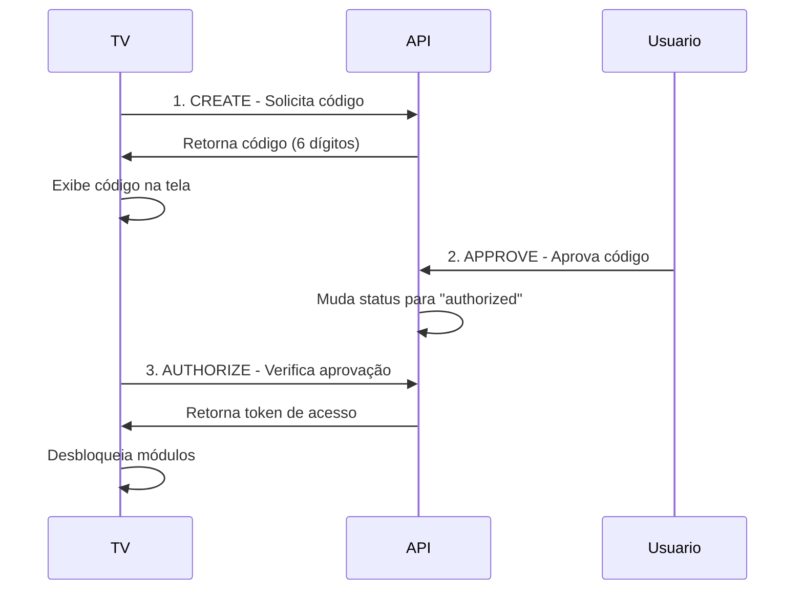

# 📺 Launcher EE - Elias Empresas para LG webOS TV

> Aplicativo estilo "launcher/hub" exclusivo para LG webOS, centralizando todos os serviços Elias Empresas diretamente na TV.

[](https://webostv.developer.lge.com/)
[](https://github.com/eliasempresas)
[](LICENSE)

## 📋 Índice

- [Visão Geral](#-visão-geral)
- [Cores e Identidade Visual](#-cores-e-identidade-visual)
- [Funcionalidades](#-funcionalidades)
- [Módulos do Ecossistema](#-módulos-do-ecossistema)
- [Estrutura do Projeto](#-estrutura-do-projeto)
- [Requisitos](#-requisitos)
- [Instalação e Configuração](#-instalação-e-configuração)
- [Empacotamento](#-empacotamento)
- [Customização](#-customização)
- [Autenticação](#-autenticação)
- [Desenvolvimento](#-desenvolvimento)
- [Troubleshooting](#-troubleshooting)

---

## 🎯 Visão Geral

O **Launcher EE** é uma aplicação completa desenvolvida especificamente para **LG webOS TV (modelo 55UP77)** que serve como hub centralizado para todos os serviços da família Elias Empresas.

### Objetivos:
- ✅ Ser a tela inicial alternativa da TV da família Elias
- ✅ Centralizar gerenciamento invisível da TV e acesso ao ecossistema EE
- ✅ Criar um ecossistema de aplicativos independentes mas integrados (superapp)
- ✅ Garantir atualizações automáticas sem depender da LG App Store

---

## 🎨 Cores e Identidade Visual

```css
COR PRINCIPAL: #FF0000 (Vermelho)
COR DE TEXTO: #000000 (Preto)
BACKGROUND: #f8f9fa (Cinza claro)
```

Toda a interface segue a identidade visual da Elias Empresas, com destaque para o vermelho característico da marca.

---

## ⚡ Funcionalidades

### 🔧 Gerenciamento Interno (Background)

O aplicativo executa em segundo plano rotinas de gerenciamento da TV:

- **Monitoramento contínuo**: CPU, RAM, temperatura, rede
- **Identificação de dispositivos**: HDMI, USB, rede local
- **Controle automatizado**: Áudio, vídeo, brilho, contraste
- **Alertas proativos**: Perda de conexão, alta temperatura, recursos elevados
- **Automação de tarefas**: Perfis automáticos (Cinema, Jogos, Música)
- **Logs centralizados**: Eventos enviados para servidor EE para análise

### 🔐 Sistema de Autenticação

Autenticação baseada em códigos temporários:
- Gera código de 6 caracteres na TV
- Aprovação manual ou remota via API
- Expiração automática em 5 minutos
- Segurança com X-API-KEY e tokens persistentes

---

## 📦 Módulos do Ecossistema

### 1. 📊 EE TV Manager
Interface para gerenciamento completo da TV:
- Status do monitoramento em tempo real
- Ajustes de entradas (HDMI, USB, rede)
- Controles de vídeo e áudio
- Perfis automáticos de uso

### 2. 🎬 Mídia EE
Versão nativa de `midia.eliasempresas.com`:
- TV ao vivo
- Filmes e séries
- Animes
- Player multimídia (HLS/DASH)

### 3. 💬 Chat EE
Versão nativa de `chat.eliasempresas.com`:
- Comunicação em tempo real
- Integração com IA
- Histórico de mensagens
- Suporte WebSocket

### 4. 📹 Câmeras EE
Sistema de vigilância integrado:
- Visualização de câmeras da Família Oliveira
- Streaming ao vivo via `streaming.eliasempresas.com/camera`
- Controle de múltiplas câmeras

### 5. 🏢 Painel Oliveira
Versão nativa de `portal.oliveira.eliasempresas.com`:
- Sistemas administrativos internos
- Dashboards em tempo real
- Gestão familiar

### 6. 📡 IPTV EE
Versão nativa de `iptv.eliasempresas.com`:
- Player nativo de listas IPTV
- Compatível com M3U/M3U8
- Gerenciamento de playlists
- Sistema de favoritos

### 7. 🌐 Internet EE
Monitoramento completo da internet:
- Velocidade em tempo real
- Histórico de conexão
- Uso de dados
- Estatísticas detalhadas

---

## 📁 Estrutura do Projeto

```
launcher-ee/
├── index.html              # Arquivo principal HTML
├── manifest.json           # Configuração webOS
├── appinfo.json           # Informações do app (gerado)
├── package.json           # Dependências Node.js
├── README.md              # Esta documentação
├── CHANGELOG.md           # Histórico de versões
├── LICENSE                # Licença proprietária
│
├── css/                   # Estilos CSS
│   ├── main.css          # Estilos principais
│   ├── auth.css          # Estilos de autenticação
│   ├── modules.css       # Estilos dos módulos
│   └── responsive.css    # Media queries e responsividade
│
├── js/                    # Scripts JavaScript
│   ├── config.js         # Configurações globais
│   ├── main.js           # Script principal e controle remoto
│   ├── auth.js           # Sistema de autenticação
│   ├── modules.js        # Gerenciador de módulos
│   ├── tv-monitor.js     # Monitoramento da TV
│   ├── media.js          # Módulo de mídia
│   ├── chat.js           # Módulo de chat
│   ├── iptv.js           # Módulo IPTV
│   └── internet.js       # Módulo de internet
│
├── assets/               # Recursos estáticos
│   ├── icon.png         # Ícone do app (80x80px mínimo)
│   ├── largeIcon.png    # Ícone grande (130x130px)
│   ├── splash.png       # Tela de splash
│   └── fonts/           # Fontes customizadas
│
├── build/               # Scripts de build
│   ├── build.sh        # Script Linux/Mac
│   ├── build.ps1       # Script Windows PowerShell
│   └── build-android.sh # Script para Termux (Android)
│
└── logs/               # Logs do aplicativo (runtime)
    └── .gitkeep
```

### 📄 Descrição dos Arquivos Principais

#### `index.html`
Estrutura HTML5 principal contendo:
- Tela de splash inicial
- Interface de autenticação
- Container principal do app
- Seções para cada módulo
- Players de vídeo (mídia e IPTV)

#### `manifest.json`
Configuração do aplicativo webOS:
```json
{
  "id": "com.eliasempresas.launcher",
  "version": "1.0.0",
  "vendor": "Elias Empresas",
  "type": "web",
  "main": "index.html",
  "title": "Launcher EE",
  "icon": "assets/icon.png",
  "largeIcon": "assets/largeIcon.png"
}
```

#### `js/config.js`
Configurações centralizadas:
- URLs das APIs
- Endpoints dos módulos
- Configurações de autenticação
- Chaves de API
- Intervalos de atualização
- Device ID único

#### `js/main.js`
Controle principal:
- Inicialização do app
- Gerenciamento de módulos
- Navegação por controle remoto
- Monitoramento de rede
- Tratamento de erros global

#### `js/auth.js`
Sistema de autenticação:
- Geração de códigos
- Validação com API
- Gerenciamento de tokens
- Renovação automática

#### `js/tv-monitor.js`
Monitoramento da TV:
- Coleta de métricas (CPU, RAM, temperatura)
- Integração com webOS APIs
- Sistema de alertas
- Controles de volume, brilho, contraste
- Perfis de uso

#### `js/modules.js`
Gerenciador de módulos:
- Classe base `BaseModule`
- Navegação entre módulos
- Estado compartilhado
- Quick actions
- Notificações

#### `js/iptv.js`, `js/media.js`, `js/chat.js`, `js/internet.js`
Implementações específicas de cada módulo com suas funcionalidades próprias.

---

## 🔧 Requisitos

### Hardware
- **TV**: LG webOS 4.0 ou superior (testado em 55UP77)
- **Processador**: Quad-core ou superior
- **RAM**: Mínimo 1.5GB
- **Armazenamento**: 100MB livre
- **Conectividade**: Internet banda larga (mínimo 10Mbps)

### Software
- **webOS**: Versão 4.0+
- **Navegador**: Chromium 53+
- **APIs**: Luna Service APIs habilitadas

### Servidor
- **Backend**: Ubuntu Server com APIs Elias Empresas
- **Endpoints ativos**:
  - `https://api.eliasempresas.com`
  - `https://midia.eliasempresas.com`
  - `https://chat.eliasempresas.com`
  - `https://iptv.eliasempresas.com`
  - `wss://chat.eliasempresas.com/ws`

---

## 🚀 Instalação e Configuração

### Pré-requisitos de Desenvolvimento

#### Node.js e NPM
```bash
# Verificar instalação
node --version  # v14.x ou superior
npm --version   # v6.x ou superior
```

#### ares-cli (webOS SDK)
```bash
# Instalar globalmente
npm install -g @webos-tools/cli

# Verificar instalação
ares --version
```

### Configuração da TV

#### 1. Habilitar Modo Desenvolvedor
1. Na TV, vá em **Configurações** → **Geral** → **Sobre a TV**
2. Clique 5 vezes no **Serial Number** para ativar o Dev Mode
3. Instale o app **Developer Mode** da LG Content Store
4. Abra o app e ative o **Dev Mode**
5. Pressione **Key Server** e anote o endereço IP

#### 2. Adicionar TV ao ares-cli
```bash
# Adicionar dispositivo
ares-setup-device

# Seguir o assistente:
# Nome: lg-tv
# IP: [IP da sua TV]
# Porta: 9922
# Usuário: prisoner

# Testar conexão
ares-device-info -d lg-tv
```

### Clone e Preparação

```bash
# Clonar repositório
git clone https://github.com/eliasempresas/launcher-ee.git
cd launcher-ee

# Instalar dependências (se houver)
npm install

# Configurar variáveis de ambiente
cp .env.example .env
# Editar .env com suas chaves de API
```

### Configuração do `js/config.js`

Edite as configurações conforme seu ambiente:

```javascript
const CONFIG = {
    API: {
        BASE_URL: 'https://api.eliasempresas.com',
        API_KEY: 'SUA_CHAVE_API_AQUI',
        // ... outras configurações
    },
    
    DEVICE: {
        deviceId: 'AUTO_GERADO', // Será gerado automaticamente
        model: 'LG 55UP77',
        // ...
    }
};
```

---

## 📦 Empacotamento

### 🐧 Linux (Ubuntu Server)

```bash
#!/bin/bash
# build.sh

# Navegar para o diretório do projeto
cd /caminho/para/launcher-ee

# Instalar ares-cli se necessário
if ! command -v ares-package &> /dev/null; then
    echo "Instalando ares-cli..."
    npm install -g @webos-tools/cli
fi

# Limpar build anterior
rm -f *.ipk

# Empacotar aplicativo
echo "Empacotando aplicativo..."
ares-package .

# Renomear para versão específica
IPK_FILE=$(ls -t *.ipk | head -1)
VERSION=$(grep -oP '"version":\s*"\K[^"]+' manifest.json)
mv "$IPK_FILE" "launcher-ee-v${VERSION}.ipk"

echo "✅ Pacote criado: launcher-ee-v${VERSION}.ipk"

# Instalar na TV (opcional)
read -p "Instalar na TV agora? (s/n) " -n 1 -r
echo
if [[ $REPLY =~ ^[Ss]$ ]]; then
    TV_DEVICE="lg-tv"  # Nome configurado no ares-setup-device
    
    echo "Desinstalando versão anterior..."
    ares-install --device $TV_DEVICE --remove com.eliasempresas.launcher 2>/dev/null
    
    echo "Instalando nova versão..."
    ares-install --device $TV_DEVICE "launcher-ee-v${VERSION}.ipk"
    
    echo "Iniciando aplicativo..."
    ares-launch --device $TV_DEVICE com.eliasempresas.launcher
    
    echo "✅ Aplicativo instalado e iniciado!"
fi
```

**Uso:**
```bash
chmod +x build/build.sh
./build/build.sh
```

### 🪟 Windows 11

```powershell
# build.ps1

# Navegar para o diretório do projeto
Set-Location "C:\caminho\para\launcher-ee"

# Verificar e instalar ares-cli
if (!(Get-Command ares-package -ErrorAction SilentlyContinue)) {
    Write-Host "Instalando ares-cli..."
    npm install -g @webos-tools/cli
}

# Limpar build anterior
Remove-Item *.ipk -ErrorAction SilentlyContinue

# Empacotar aplicativo
Write-Host "Empacotando aplicativo..."
ares-package .

# Renomear para versão específica
$manifest = Get-Content manifest.json | ConvertFrom-Json
$version = $manifest.version
$ipkFile = Get-ChildItem -Filter *.ipk | Sort-Object LastWriteTime -Descending | Select-Object -First 1
Rename-Item $ipkFile.Name "launcher-ee-v$version.ipk"

Write-Host "✅ Pacote criado: launcher-ee-v$version.ipk"

# Instalar na TV (opcional)
$install = Read-Host "Instalar na TV agora? (s/n)"
if ($install -eq "s") {
    $tvDevice = "lg-tv"  # Nome configurado no ares-setup-device
    
    Write-Host "Desinstalando versão anterior..."
    ares-install --device $tvDevice --remove com.eliasempresas.launcher 2>$null
    
    Write-Host "Instalando nova versão..."
    ares-install --device $tvDevice "launcher-ee-v$version.ipk"
    
    Write-Host "Iniciando aplicativo..."
    ares-launch --device $tvDevice com.eliasempresas.launcher
    
    Write-Host "✅ Aplicativo instalado e iniciado!"
}
```

**Uso:**
```powershell
Set-ExecutionPolicy -ExecutionPolicy RemoteSigned -Scope CurrentUser
.\build\build.ps1
```

### 🤖 Android (Termux)

```bash
#!/data/data/com.termux/files/usr/bin/bash
# build-android.sh

# Instalar dependências
pkg update
pkg install -y nodejs git

# Instalar ares-cli
npm install -g @webos-tools/cli

# Navegar para o projeto
cd ~/launcher-ee

# Limpar build anterior
rm -f *.ipk

# Empacotar
echo "Empacotando aplicativo..."
ares-package .

# Renomear
VERSION=$(grep -oP '"version":\s*"\K[^"]+' manifest.json)
IPK_FILE=$(ls -t *.ipk | head -1)
mv "$IPK_FILE" "launcher-ee-v${VERSION}.ipk"

echo "✅ Pacote criado: launcher-ee-v${VERSION}.ipk"
echo "📱 Arquivo disponível em: ~/launcher-ee/launcher-ee-v${VERSION}.ipk"
echo ""
echo "Para instalar na TV:"
echo "1. Transfira o arquivo .ipk para um computador"
echo "2. Use ares-install no computador para instalar na TV"
```

**Uso no Termux:**
```bash
chmod +x build/build-android.sh
./build/build-android.sh
```

### Comandos Úteis

```bash
# Listar dispositivos conectados
ares-setup-device --list

# Informações da TV
ares-device-info -d lg-tv

# Instalar aplicativo
ares-install -d lg-tv launcher-ee-v1.0.0.ipk

# Desinstalar aplicativo
ares-install -d lg-tv --remove com.eliasempresas.launcher

# Executar aplicativo
ares-launch -d lg-tv com.eliasempresas.launcher

# Fechar aplicativo
ares-launch -d lg-tv --close com.eliasempresas.launcher

# Ver logs em tempo real
ares-inspect -d lg-tv -a com.eliasempresas.launcher

# Inspecionar aplicativo (Developer Tools)
ares-inspect -d lg-tv -a com.eliasempresas.launcher --open
```

---

## 🎨 Customização

### Alterando Cores

Edite o arquivo `css/main.css`:

```css
:root {
    --primary-color: #FF0000;     /* Cor principal */
    --text-color: #000000;        /* Cor do texto */
    --background: #f8f9fa;        /* Fundo */
    --card-bg: #ffffff;           /* Fundo dos cards */
    --hover-color: #cc0000;       /* Hover */
}
```

### Alterando Ícones

Os ícones devem estar em `/assets/`:

- `icon.png`: 80x80px (mínimo) - Ícone pequeno
- `largeIcon.png`: 130x130px (recomendado) - Ícone grande
- `splash.png`: 1920x1080px - Tela de splash

**Dicas:**
- Use formato PNG com transparência
- Mantenha proporções quadradas
- Otimize para tamanho (< 50KB cada)

### Alterando manifest.json

```json
{
  "id": "com.suaempresa.launcher",
  "version": "1.0.0",
  "vendor": "Sua Empresa",
  "type": "web",
  "main": "index.html",
  "title": "Seu Launcher",
  "icon": "assets/icon.png",
  "largeIcon": "assets/largeIcon.png",
  "splashBackground": "assets/splash.png",
  "resolution": "1920x1080",
  "bgColor": "#f8f9fa"
}
```

**Importante:** Sempre que alterar o `id`, atualize também em:
- `js/config.js` → `APP_ID`
- Scripts de build
- Comandos de instalação

### Configurando APIs

Edite `js/config.js`:

```javascript
API: {
    BASE_URL: 'https://sua-api.com',
    API_KEY: 'sua-chave-secreta',
    AUTH_ENDPOINT: '/auth/tv',
    // ...
}
```

### Adicionando Novos Módulos

1. Crie um novo arquivo em `/js/` (ex: `novo-modulo.js`)
2. Estenda a classe `BaseModule`:

```javascript
class NovoModulo extends BaseModule {
    constructor(config) {
        super(config);
        this.init();
    }
    
    init() {
        super.init();
        // Sua inicialização
    }
    
    activate() {
        super.activate();
        // Ativação do módulo
    }
    
    deactivate() {
        super.deactivate();
        // Desativação do módulo
    }
}
```

3. Registre no `modules.js`:

```javascript
window.moduloNovo = new NovoModulo(CONFIG.MODULES.NOVO);
```

4. Adicione HTML correspondente em `index.html`

---

## 🔐 Autenticação

### Fluxo de Autenticação



### Endpoint da API

**Base URL:** `https://api.eliasempresas.com/APIEE/familiaoliveiraEE/tv.php`

#### 1. CREATE - Criar Código

```http
POST /tv.php
Content-Type: application/json
X-API-KEY: sua-chave-api

{
  "function": "create",
  "deviceId": "unique-device-id"
}
```

**Resposta:**
```json
{
  "success": true,
  "code": "A1B2C3",
  "expiresIn": 300,
  "status": "pending"
}
```

#### 2. APPROVE - Aprovar Código

```http
POST /tv.php
Content-Type: application/json
X-API-KEY: sua-chave-api

{
  "function": "approve",
  "code": "A1B2C3"
}
```

**Resposta:**
```json
{
  "success": true,
  "status": "authorized"
}
```

#### 3. AUTHORIZE - Verificar Autorização

```http
POST /tv.php
Content-Type: application/json
X-API-KEY: sua-chave-api

{
  "function": "authorize",
  "code": "A1B2C3",
  "deviceId": "unique-device-id"
}
```

**Resposta:**
```json
{
  "success": true,
  "authorized": true,
  "token": "eyJhbGciOiJIUzI1NiIsInR5cCI6IkpXVCJ9...",
  "expiresAt": 1234567890
}
```

### Implementação no Código

Ver arquivo `js/auth.js` para implementação completa.

---

## 💻 Desenvolvimento

### Ambiente Local

Para testar localmente antes de instalar na TV:

```bash
# Instalar servidor HTTP simples
npm install -g http-server

# Servir aplicativo
cd launcher-ee
http-server -p 8080

# Abrir no navegador
# http://localhost:8080
```

**Nota:** Algumas funcionalidades específicas de webOS não funcionarão em navegador comum.

### Debug Remoto

```bash
# Inspecionar app na TV com DevTools
ares-inspect -d lg-tv -a com.eliasempresas.launcher --open

# Visualizar logs
ares-inspect -d lg-tv -a com.eliasempresas.launcher
```

### Estrutura de Logs

Logs são salvos em `localStorage` e enviados para o servidor:

```javascript
logger.info('Mensagem informativa');
logger.warn('Aviso');
logger.error('Erro', errorObject);
```

Ver implementação em `js/config.js` → classe `Logger`.

---

## 🐛 Troubleshooting

### App não inicia

```bash
# Verificar se está instalado
ares-install -d lg-tv --list

# Ver logs de erro
ares-inspect -d lg-tv -a com.eliasempresas.launcher

# Reinstalar
ares-install -d lg-tv --remove com.eliasempresas.launcher
ares-install -d lg-tv launcher-ee.ipk
```

### Erro de conexão com TV

```bash
# Reconfigurar dispositivo
ares-setup-device

# Verificar conectividade
ping [IP-DA-TV]

# Verificar se Dev Mode está ativo na TV
```

### APIs não respondem

1. Verificar conectividade de rede na TV
2. Verificar se as URLs das APIs estão corretas em `js/config.js`
3. Verificar chave de API (`X-API-KEY`)
4. Ver logs no navegador DevTools

### Vídeo não reproduz

1. Verificar formato do vídeo (suportado: MP4, HLS, DASH)
2. Verificar CORS nas APIs de vídeo
3. Testar URL do vídeo diretamente no navegador
4. Ver console para erros de codec

### Controle remoto não funciona

1. Verificar se o foco está no app
2. Ver `js/main.js` → método `handleRemoteControl()`
3. Testar com keyboard no DevTools

---

## 📊 Monitoramento e Métricas

O aplicativo envia métricas para o servidor:

```javascript
{
  "timestamp": "2025-01-07T10:30:00Z",
  "deviceId": "lg-tv-12345",
  "metrics": {
    "cpu": 45,
    "ram": 60,
    "temperature": 42,
    "network": "online",
    "uptime": 86400
  }
}
```

Endpoint: `POST https://api.eliasempresas.com/metrics`

---

## 🚀 Roadmap

### FASE 1: Launcher básico ✅
- [x] Interface principal
- [x] Sistema de autenticação
- [x] Módulo Mídia EE
- [x] Navegação por controle remoto

### FASE 2: Gerenciamento ✅
- [x] TV Manager
- [x] Monitoramento em background
- [x] IPTV EE
- [x] Sistema de alertas

### FASE 3: Expansão ✅
- [x] Chat EE
- [x] Painel Oliveira
- [x] Internet Monitor
- [x] Câmeras EE (estrutura)

### FASE 4: IA e Automação 🔄
- [ ] IA EE integrada
- [ ] Assistente de voz
- [ ] Automações inteligentes
- [ ] Reconhecimento de usuário

---

## 📝 Changelog

Ver arquivo [CHANGELOG.md](CHANGELOG.md) para histórico completo.

**v1.0.0** (2025-01-07)
- 🎉 Lançamento inicial
- ✅ Todos os módulos implementados
- ✅ Sistema de autenticação funcional
- ✅ Integração com webOS APIs
- 🔒 Correções de segurança (XSS, SSRF)
- 📊 Sistema de monitoramento completo

---

## 📄 Licença

© 2025 Elias Empresas. Todos os direitos reservados.

Este software é proprietário e confidencial. Uso não autorizado é estritamente proibido.

---

## 👥 Suporte

Para suporte técnico:
- **Email**: suporte@eliasempresas.com
- **Portal**: https://portal.oliveira.eliasempresas.com
- **Telefone**: +55 (XX) XXXXX-XXXX

---

## 🙏 Agradecimentos

Desenvolvido com ❤️ pela equipe Elias Empresas para a Família Oliveira.

**Tecnologias utilizadas:**
- LG webOS SDK
- HTML5 / CSS3 / JavaScript ES6+
- WebSocket (Chat em tempo real)
- HLS/DASH (Streaming de vídeo)
- Luna Service APIs (Integração webOS)

---

**🔴 Launcher EE - Centralizando o futuro na sua TV**
